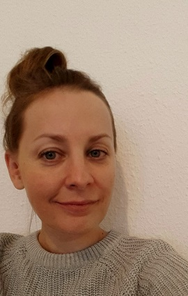
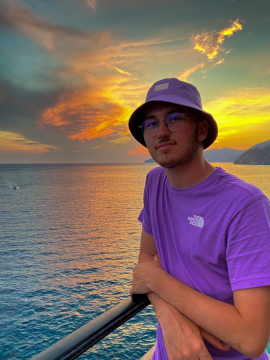
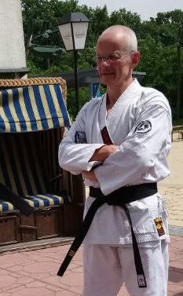

## Current members

### [Alexandre Courtiol](https://www.izw-berlin.de/en/alex-courtiol-en.html) 🇫🇷

:::float-left-gang

Member and boss of the DZG since 2012. [<i class='fa-brands fa-bluesky'></i> <i class='fa fa-flask'></i>](https://bsky.app/profile/datazoogang.de), [<i class='fa fa-twitter'></i> <i class='fab fa-r-project'></i>](https://twitter.com/rdataberlin)
<!-- [ <i class='fa fa-flask'></i>](https://ecoevo.social/@courtiol), [  <i class='fab fa-r-project'></i>](https://fosstodon.org/@rdataberlin)-->.
Senior researcher, lecturer. Initially trained as an evolutionary biologist with an additional emphasis on applied statistics, Alex has adopted ecology and demography after his PhD. He is mostly interested in humans, wild mammals and birds. His favorite research projects are those revealing unexpected outcomes. His focus is on questions related to life history and behaviour, but he is always open to new exciting collaborations. He likes programming and teaching R.
:::

### Vladislav Marcuk 🇩🇪
:::float-right-gang

Member since 2024. Despite having a full time job as a curator looking after some of the most endangered parrots in the world, Vladi took on to do a PhD with us in his spare time. He is trying to figure out how science could help improve the ex-situ breeding of Spix's macaws in view of reintroducing the species successfully into the wild. Vladi is also an artist who creates beautiful hand-drawings of his beloved creatures.
:::

## Former members

### Ben Battersby 🇦🇺

:::float-left-gang

Member during the month of July 2025. Ben came for a short stay to strengthen his R skills and teach us about wildebeest (also known as gnu). He is running a long-term study on the movement of these wild beasts in Tanzania and he has published a beautiful picture book about them. If you visit us, you will also see one of Ben's painting in the office. Like several other members he is an accomplished artist as well as a scientist.
:::

### Leonie Walter 🇩🇪

:::float-right-gang

Member October 2022 to November 2024.
After discovering her weird (yet unrequited) love towards stats and data science, Leonie joined the team for an internship during her Master in biology. She then stayed for her master thesis to find out the demographic cost of inbreeding depression in our favourite population of spotted hyenas. After that she became the gang's research assistant.
:::

### Alexis Verfaillie 🇫🇷

:::float-left-gang

Member January to June 2023. [<i class='fa fa-twitter'></i>](https://twitter.com/alexisverf)
Alexis did his master thesis in our group. He is interested in all kinds of cats. He was with us to study the inclusive fitness consequences of "coups" (unexpected changes occurring in social hierarchy) in... spotted hyenas. This animal is not a cat, but we convinced him it is close enough since hyenas belong to the suborder *Feliformia*.
:::

### [Liam Bailey](https://www.liamdbailey.com) 🇦🇺

:::float-right-gang

Member 2018-2023. [<i class='fa fa-twitter'></i>](https://twitter.com/ldbailey255).
Liam came to the group as a postdoc interested in understanding how ecosystems are affected by and respond to environmental change, particularly in the context of climate change. His research often involves long-term demographic datasets, and he loves using R and his experience as a data scientist to work with these data and answer scientific questions. While he started his research with birds, since he came to us, Liam has branched out to include research with wild mammals. He also enjoys data visualization and teaching others how to visually communicate their ideas and scientific findings. Liam is now working for the WWF as a data scientist.
:::

### [Colin Vullioud](https://de.linkedin.com/in/colin-vullioud-a7a500186) 🇨🇭

:::float-left-gang

Member 2017-2021.
Colin came to us after getting fed up with social science research, learned R with us, and turned social behavior into algorithms.
He also created the R package {torpor} and contributed to {hyenaR}.
He left the DZG as a fully fledged data scientist and after spending a few years as a freelancer in Berlin, Colin is now doing a PhD in Freiburg, simulating forests use.
He is also an artist who has started to include R in his projects.
:::

### [Elisa Donati](https://www.researchgate.net/profile/Elisa-Donati) 🇮🇹

:::float-right-gang

Member 2020. 
Elisa came to program virtual hyenas and to work on our R package {hyenaR}.
She did this between a master's thesis on lizards and a research project that involved setting up a complex simulation platform so as to model the coastal ecosystem of Venice, with a view to allowing sustainable exploitation by humans.
She now continues modelling coastal ecosystems, this time as a PhD student in Trieste, Italy.
:::

### Louise Chevalier 🇫🇷

:::float-left-gang

Member 2019.
Louise came for a few months during her PhD to do something else for a while. She worked with us on adding genetics to a simulation model about hyenas.
Then, she returned to her PhD -- building fancy demo-genetics models to better understand the role of demography and genomic constraints on the evolution of mate choice.
She is now a circus artist in France.
:::

### [Ian Rickard](https://uk.linkedin.com/in/ianjaric) 🇬🇧

:::float-right-gang

Member 2017-2018.
Ian came for a sabbatical from Durham University to study how twinning connects to fertility in humans, then switched career to become a data scientist for the ministry of justice in the UK. Ian and Alex were both postdocs in the same team in Sheffield (UK) headed by our collaborator [Virpi Lummaa](#VL).
:::

### [Robert Schwieger](https://de.linkedin.com/in/robert-schwieger-431ab4197) 🇩🇪

:::float-left-gang

Member 2015-2016.
Robert came to do maths on inference problems about mate choice before doing a PhD in applied mathematics on gene regulatory networks.
He is now working at [CENTOGENE](https://www.centogene.com) in Berlin, Germany.
:::

### [Camille Martinez Almoyna](https://scholar.google.de/citations?hl=en&user=KsalObYAAAAJ) 🇫🇷

:::float-right-gang

Member 2015-2016.
Camille did a joint internship here and in Montpellier developing stats methods to draw inferences using simulations. She then applied her statistics skills during her master's project and PhD to study interactions in soil between plants and other lifeforms, across alpine elevation gradients. She is currently doing a postdoc in Grenoble, France.
:::

### Loïc Etienne 🇫🇷

:::float-left-gang

Member 2012-2014.
Loïc did his PhD with us, modelling the evolution of mutual mate choice.
He was co-supervised by Alex, our long standing collaborator [François Rousset](#FR), and [Bernard Godelle](https://www.researchgate.net/profile/Bernard-Godelle-2). 
After his PhD, Loïc worked as a high-school teacher, and he is now a full time musician in France.
:::

## Friends

Not quite members, not quite collaborators, but very close to us all the same!

### [Jörns Fickel](https://www.izw-berlin.de/en/joerns-fickel-en.html) 🇩🇪 {#joerns_fickel}

:::float-right-gang

Jörns Fickel is the wise [Sensei](https://en.wikipedia.org/wiki/Sensei) in charge of the IZW [Department of Evolutionary Genetics](https://www.izw-berlin.de/en/department-of-evolutionary-genetics.html) to which we belong.
He is also leading the [course on conservation genetics](teaching.html#teaching_conservation_genetics) to which we contribute. He is currently the acting director of the IZW as well.
We are delighted that he has our back, and effectively defend our interests within the IZW and beyond.
:::

### Ilja Heckmann 🇰🇿🇩🇪
Ilja is a biologist colleague turned full time python programmer and Linux admin from whom we never stop learning.

### [Zimai Li](https://www.ulrichlab.com/zimai-li) 🇨🇳

:::float-left-gang

Zimai worked with us on our R package {hyenaR} while doing an internship with colleagues from the [hyena project](https://hyena-project.com) on mate choice in spotted hyenas.
After his stay with us, he joined [Yuko Ulrich](https://www.ulrichlab.com/yuko-ulrich) to study interactions between infections and behaviour in clonal raider ants. His PhD almost over, he is now back in Berlin!
:::

### [Matthias Gallipaud](https://ch.linkedin.com/in/matthias-galipaud-980a241a1) 🇫🇷

:::float-right-gang

Matthias is a long standing idea bouncer for the DZG.
He did his PhD with [François Xavier Dechaume-Moncharmont](http://www.fxdm.org) who was in Dijon at the time (now in Lyon) and then a postdoc with [Hanna Kokko](http://www.kokkonuts.org/) in Zurich, Switzerland.
Matthias stayed in Zurich and he is now working as a data scientist at the [Swiss Data Science Center (SDSC)](https://datascience.ch).
:::

## Main collaborators

### [François Rousset](https://kimura.univ-montp2.fr/~rousset) 🇫🇷{#FR}

:::float-left-gang

François is a theoretical biologist at the [Institut des Sciences de l'Evolution in Montpellier](https://isem-evolution.fr), France, turned hardcore statistician, author of R package {spaMM} without which we could not do half the work we do.
:::

### [Oliver Höner](https://www.izw-berlin.de/en/oliver-patrick-hoener-en.html) 🇨🇭🇧🇷

:::float-right-gang

Oliver is the leader of the [hyena project](https://hyena-project.com).
He's a behavioral ecologist and field biologist who turns anything hyena related into high quality datasets.
Oliver is based in the department of Evolutionary Ecology at the [IZW](https://www.izw-berlin.de/en/home.html).
We also collaborate intensively with Oliver's student(s) -- currently [Marta Mosna] -- and with other members of the project, especially co-leader [Eve Davidian](https://www.researchgate.net/profile/Eve-Davidian).
:::

### [Viktoriia Radchuk](https://www.viktoriiaradchuk.com/) 🇺🇦

:::float-left-gang

Viktoriia is an individual-based modeler and the producer of big collaborative meta-analyses.
Like us she flourishes at the interface between field and theory.
She is a key member of the department of [Ecological Dynamics](https://ecological-dynamics-izw.com/) at the [IZW](https://www.izw-berlin.de/en/home.html).
:::

### [Stephanie Kramer-Schadt](https://www.izw-berlin.de/en/stephanie-kramer-schadt-en.html) 🇩🇪

:::float-right-gang

Stephanie is head of the excellent department [Ecological Dynamics](https://ecological-dynamics-izw.com/) at the [IZW](https://www.izw-berlin.de/en/home.html) which is composed, almost exclusively, of great young scientists and students with strong quantitative skills.
:::

### [Christian Voigt](https://www.izw-berlin.de/en/christian-voigt-en.html) 🇩🇪

:::float-left-gang

Christian is head of the department of Evolutionary Ecology at the [IZW](https://www.izw-berlin.de/en/home.html) and head of the [BatLab](https://www.batlab.de). His large team studies the ecophysiology of bats, as well as various topics relevant for the conservation of bats, such as their migration.
:::

### [Virpi Lummaa](https://www.utu.fi/en/people/virpi-lummaa) 🇫🇮{#VL}

:::float-right-gang

Virpi is the life history data queen who has produced two of the very best demographic datasets that exist (one on pre-industrial humans and one on Asian Elephants).
She is head of the [human life history science group](https://human-life-history.science) and of the [Myanmar Timber Elephant Project](https://elephant-project.science) at the [University of Turku](https://www.utu.fi/en) in Finland.
:::

## Collaborators wishlist

They never worked with us, but are very much like us, so we hope to work with them one day: [Sarah Cubaynes](https://sarahcubaynes144031551.wordpress.com/about) 🇫🇷, [Olivier Gimenez](https://oliviergimenez.github.io) 🇫🇷, [Samuel Pavard](https://www.ecoanthropologie.fr/fr/annuaire/pavard-samuel-6078) 🇫🇷, [François Xavier Dechaume-Moncharmont](http://www.fxdm.org) 🇫🇷.
There is also [Erik Postma](https://www.lifelovedeath.net/) 🇳🇱 with whom we worked a little already, but we would love to do more with him.
