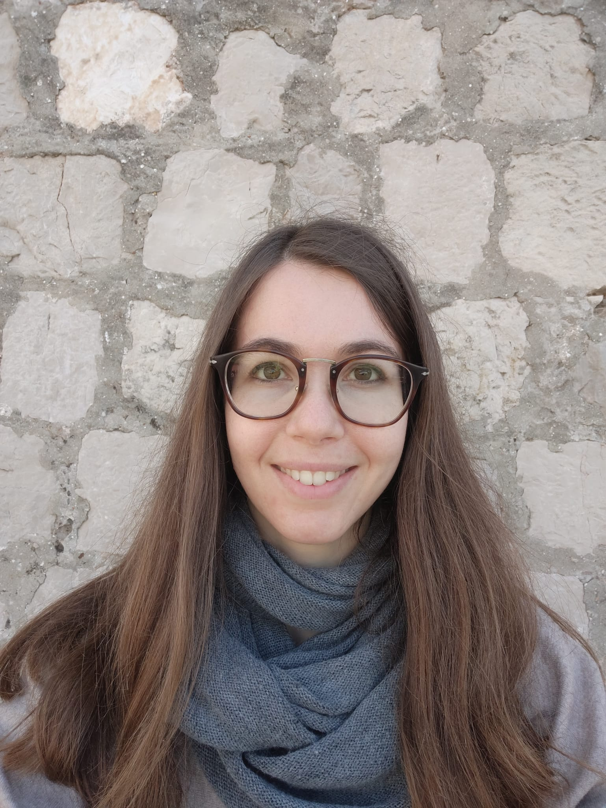
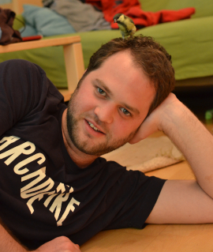
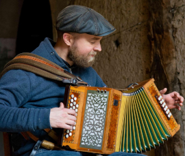
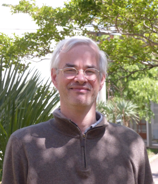
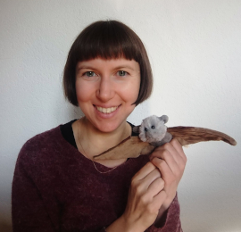
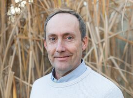
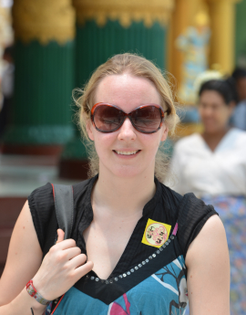

## Current members

### [Alexandre Courtiol](https://www.izw-berlin.de/en/alex-courtiol-en.html) 🇫🇷

:::float-left

Member since 2012. [<i class='fa fa-twitter'></i> (personal)](https://twitter.com/alexcourtiol), [<i class='fa fa-twitter'></i> (R)](https://twitter.com/rdataberlin).
Senior researcher, lecturer. Initially trained as an evolutionary biologist with an additional emphasis on applied statistics, Alex has adopted ecology and demography after his PhD. He is mostly interested in humans, wild mammals and birds. His favorite research projects are those revealing unexpected outcomes. His focus is on questions related to life history and behaviour, but he is always open to new exciting collaborations. He likes programming and teaching R.
:::

### [Liam Bailey](https://www.liamdbailey.com) 🇦🇺

:::float-right

Member since 2018. [<i class='fa fa-twitter'></i>](https://twitter.com/ldbailey255).
Postdoc. SHORT 3rd PERSON DESCRIPTION TODO.
:::

## Former members

### [Colin Vullioud](https://de.linkedin.com/in/colin-vullioud-a7a500186) 🇨🇭

:::float-left

Member 2017-2021.
Colin came to us after getting fed up with social science research, learned R with us, and turned social behavior into algorithms.
He also created the R package {torpor} and contributed to {hyenaR}.
He left the DZG as a fully fledged data scientist currently working as a freelancer in Berlin, Germany.
He is also an artist who has started to include R in his projects.
:::

### [Elisa Donati](https://www.researchgate.net/profile/Elisa-Donati) 🇮🇹

:::float-right

Member 2020. 
Elisa came to program virtual hyenas and to work on our R package {hyneaR}. She did this between a master's thesis on lizards and a research project that involved setting up a complex simulation platform so as to model the coastal ecosystem of Venice, with a view to allowing sustainable exploitation by humans.
She is now looking for a PhD in Italy (too bad for us, otherwise we would have kept her here in Berlin!).
:::

### Louise Chevalier 🇫🇷

:::float-left

Member 2019.
Louise came for a few months during her PhD to do something else for a while. She worked with us on adding genetics to a simulation model about hyenas.
Then, she returned to her PhD -- building fancy demo-genetics models to better understand the role of demography and genomic constraints on the evolution of mate choice.
She is now a circus artist in France.
:::

### [Ian Rickard](https://uk.linkedin.com/in/ianjaric) 🇬🇧

:::float-right

Member 2017-2018.
Ian came for a sabbatical from Durham University to study how twinning connects to fertility in humans, then switched career to become a data scientist for the ministry of justice in the UK. Ian and Alex were both postdocs in the same team in Sheffield (UK) headed by our collaborator [Virpi Lummaa](#VL).
:::

### [Robert Schwieger](https://de.linkedin.com/in/robert-schwieger-431ab4197) 🇩🇪

:::float-left

Member 2015-2016.
Robert came to do maths on inference problems about mate choice before doing a PhD in applied mathematics on gene regulatory networks.
He is now working at [CENTOGENE](https://www.centogene.com) in Berlin, Germany.
:::

### [Camille Martinez Almoyna](https://scholar.google.de/citations?hl=en&user=KsalObYAAAAJ) 🇫🇷

:::float-right

Member 2015-2016.
Camille did a joint internship here and in Montpellier developing stats methods to draw inferences using simulations. She then applied her statistics skills during her master's project and PhD to study interactions in soil between plants and other lifeforms, across alpine elevation gradients. She is currently doing a postdoc in Grenoble, France.
:::

### Loïc Etienne 🇫🇷

:::float-left

Member 2012-2014.
Loïc did his PhD with us, modelling the evolution of mutual mate choice.
He was co-supervised by Alex, our long standing collaborator [François Rousset](#FR), and [Bernard Godelle](https://www.researchgate.net/profile/Bernard-Godelle-2). 
After his PhD, Loïc worked as a high-school teacher, and he is now a full time musician in France.
:::

## Friends

Not quite members, not quite collaborators, but very close to us all the same!

### [Zimai Li](https://www.ulrichlab.com/zimai-li) 🇨🇳

:::float-right

Zimai worked with us on our R package {hyneaR} while doing an internship with colleagues from the [hyena project](https://hyena-project.com) on mate choice in spotted hyenas.
After his stay with us, he joined [Yuko Ulrich](https://www.ulrichlab.com/yuko-ulrich) to study interactions between infections and behaviour in clonal raider ants.
:::

### [Matthias Gallipaud](https://ch.linkedin.com/in/matthias-galipaud-980a241a1) 🇫🇷

:::float-left

Matthias is a long standing idea bouncer for the DZG.
He did his PhD with [François Xavier Dechaume-Moncharmont](http://www.fxdm.org) who was in Dijon at the time (now in Lyon) and then a postdoc with [Hanna Kokko](http://www.kokkonuts.org/) in Zurich, Switzerland.
Matthias stayed in Zurich and is currently a data scientist working for [UrbanDataLab](https://urbandatalab.ch), a startup specialising in GIS and spatial analyses. He also does statistical consulting, on the side, as a [freelancer](https://www.upwork.com/freelancers/~01ea2e83906c8e5a7c?suggest-vem-skills).
:::

### Ilja Heckmann 🇰🇿🇩🇪
Ilja is a biologist colleague turned full time python programmer and Linux admin from whom we never stop learning.

## Main collaborators

### [François Rousset](https://kimura.univ-montp2.fr/~rousset) 🇫🇷{#FR}

:::float-right

François is a theoretical biologist at the [Institut des Sciences de l'Evolution in Montpellier](https://isem-evolution.fr), France, turned hardcore statistician, author of R package {spaMM} without which we could not do half the work we do.
:::

### [Oliver Höner](https://www.izw-berlin.de/en/oliver-patrick-hoener-en.html) 🇨🇭🇧🇷

:::float-left

Oliver is the leader of the [hyena project](https://hyena-project.com).
He's a behavioral ecologist and field biologist who turns anything hyena related into high quality datasets.
He is based in the department of Evolutionary Ecology at the [IZW](https://www.izw-berlin.de/en/home.html).
:::

### [Viktoriia Radchuk](https://www.viktoriiaradchuk.com/) 🇺🇦

:::float-right

Viktoriia is an individual-based modeler and the producer of big collaborative meta-analyses.
Like us she flourishes at the interface between field and theory.
She is a key member of the department of [Ecological Dynamics](https://ecological-dynamics-izw.com/) at the [IZW](https://www.izw-berlin.de/en/home.html).
:::

### [Stephanie Kramer-Schadt](https://www.izw-berlin.de/en/stephanie-kramer-schadt-en.html) 🇩🇪

:::float-left

Stephanie is head of the excellent department [Ecological Dynamics](https://ecological-dynamics-izw.com/) at the [IZW](https://www.izw-berlin.de/en/home.html) which is composed, almost exclusively, of great young scientists and students with strong quantitative skills.
:::

### [Kseniia Kravchenko](https://www.researchgate.net/profile/Kseniia-Kravchenko) 🇺🇦

:::float-right

Kseniia has freshly finished her PhD at the [BatLab](https://www.batlab.de) from the [IZW](https://www.izw-berlin.de/en/home.html).
She is a batwomen with whom we try to predict the future distribution of hibernation niches by combining physiology and climate change.
:::

### [Christian Voigt](https://www.izw-berlin.de/en/christian-voigt-en.html) 🇩🇪

:::float-left

Christian is head of the department of Evolutionary Ecology at the [IZW](https://www.izw-berlin.de/en/home.html) and head of the [BatLab](https://www.batlab.de). His large team studies the ecophysiology of bats, as well as various topics relevant for the conservation of bats, such as their migration.
:::

### [Virpi Lummaa](https://www.utu.fi/en/people/virpi-lummaa) 🇫🇮{#VL}

:::float-right

Virpi is the life history data queen who has produced two of the very best demographic datasets that exist (one on pre-industrial humans and one on Asian Elephants).
She is head of the [human life history science group](https://human-life-history.science) and of the [Myanmar Timber Elephant Project](https://elephant-project.science) at the [University of Turku](https://www.utu.fi/en) in Finland.
:::

## Collaborators wishlist

They never worked with us, but are very much like us, so we hope to work with them one day: [Sarah Cubaynes](https://sarahcubaynes144031551.wordpress.com/about) 🇫🇷, [Olivier Gimenez](https://oliviergimenez.github.io) 🇫🇷, [Samuel Pavard](https://www.ecoanthropologie.fr/fr/annuaire/pavard-samuel-6078) 🇫🇷, [François Xavier Dechaume-Moncharmont](http://www.fxdm.org) 🇫🇷.
There is also [Erik Postma](https://www.lifelovedeath.net/) 🇳🇱 with whom we worked a little already, but we would love to do more with him.
