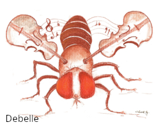
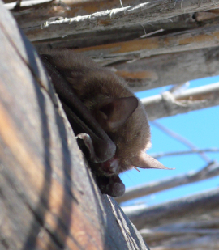
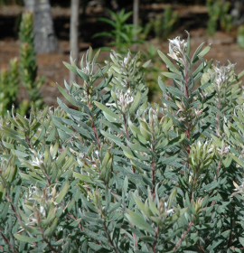
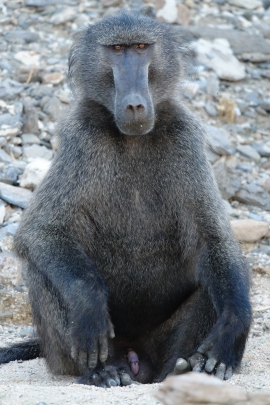
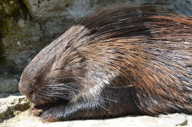

Publications are sorted by multiple criteria and you can jump directly to the following categories: [most recent](#recent), [selection](#best), [themes](#themes), [taxonomic groups](#taxons).

**Hover on top of a publication to reveal its details** (or click if using a phone).

Only publications created while being part of the Data Zoo Gang are listed here.
For the full list of publications of a given team member, please refer to: 

- Google Scholar:
[Alexandre Courtiol](https://scholar.google.com/citations?user=tyq-eagAAAAJ),
[Liam D. Bailey](https://scholar.google.com/citations?user=ys7AYRUAAAAJ),
[Ian J. Rickard](https://scholar.google.com/citations?user=eTP-OeMAAAAJ).

- ORCID:
[Alexandre Courtiol](https://orcid.org/0000-0003-0637-2959), 
[Liam D. Bailey](https://orcid.org/0000-0002-8226-9454),
[Colin Vullioud](https://orcid.org/0000-0001-9218-1571),
[Ian J. Rickard](https://orcid.org/0000-0003-0762-1689),
[Camille Martinez-Almoyna](https://orcid.org/0000-0002-3624-7932).

## Most recent {#recent}

Our publications from the last 2 years are: @bailey_bird_2022, @fasel_assigning_2022, @kruszynski_high_2022, @azevedo_decreasing_2021, @culina_connecting_2021, @dayaram_seasonal_2021, @kruszynski_identifying_2021 and @tonnabel_sexspecific_2021.

## Selection {#best}

Here is a short selection of recent DZG publications we are particularly proud of and which best reflect our involvement and mindset.

- @bailey_bird_2022 is a meta-analysis of 67 populations of great and blue tits investigating the link between the phenotypic plasticity on their phenology and climate change -- published in *Nature Communications*.
- @culina_connecting_2021 is a paper announcing the creation of the SPI-Birds network and its database for long-term population studies on birds -- published in *Journal of Animal Ecology*.
- @radchuk_adaptive_2019 is a meta-analysis quantifying precisely the extent to which animals (mostly birds) are adapting to changing climate -- published in *Nature Communications*.
- @vullioud_social_2019 is an in-depth study of social hierarchy in spotted hyenas revealing how social rank emerges from simple behavioural rules -- published in *Nature Ecology & Evolution*.
- @corbett_transition_2018 is a review of the causes and consequences of demographic transitions in humans, with an emphasis on human health -- published in *Nature Reviews Genetics*.
- @lahdenpera_differences_2018 is a detailed study of how capture influences survival in Asian elephants -- published in *Nature Communications*.

## Themes {#themes}

We study [wildlife conservation](#conservation), the ecology and evolution of [life history traits](#traits), [animal behaviour](#behaviour), [morphology](#morphology), as well as various aspects of [health](#health) in wildlife populations.
We also design [methods](#methods) that can be applied to study these themes.

### Wildlife conservation {#conservation}

#### Climate change

@bailey_bird_2022, @radchuk_adaptive_2019, @mumby_climatic_2013

#### Habitat degradation (including urbanisation)

@kruszynski_high_2022, @merling_de_chapa_phantom_2020, @trinogga_fragmentation_2019, @krone_monitoring_2019, @seltmann_habitat_2017

#### Reproduction and management

@eder_equilibration_2020, @kretzschmar_mate_2020, @hryciuk_functional_2019, @saragusty_sperm_2016, @wilting_planning_2015

#### Effect of capture and captivity

@lahdenpera_differences_2018, @heinrich_cheetahs_2017, @mumby_birth_2013

### Life history {#traits}

#### Lifespan

@lahdenpera_differences_2018, @corbett_transition_2018, @mumby_climatic_2013, @schneeberger_immune_2014

#### Mating, reproductive success and fitness

@tonnabel_sexspecific_2021, @radchuk_adaptive_2019, @corbett_transition_2018, @courtiol_when_2016, @pettay_effects_2014, @courtiol_natural_2012

#### Effect of climate and seasonality

@bailey_bird_2022, @radchuk_adaptive_2019, @mumby_stress_2015, @mumby_climatic_2013, @mumby_birth_2013, @rickard_intergenerational_2012

#### Effect of demography

@corbett_transition_2018, @courtiol_demographic_2013

### Behaviour {#behaviour}

#### Perception

@levrero_social_2015, @cohen_relevance_2015, @renoult_novel_2013

#### Mate choice

@kretzschmar_mate_2020, @debelle_mate_2017, @courtiol_evolution_2016, @santos_mhc-dependent_2016, @davidian_why_2016, @etienne_how_2014

#### Migration and dispersion

@kruszynski_high_2022, @kruszynski_identifying_2021, @kravchenko_generational_2020, @courtiol_isoscape_2019, @hobson_outlook_2019, @courtiol_modelling_2017, @davidian_why_2016

#### Social hierarchy

@vullioud_social_2019

### Health {#health}

#### Diseases

@dayaram_seasonal_2021, @merling_de_chapa_phantom_2020, @numberger_recovery_2019, @franz_sicknessinduced_2018, @cui_comprehensive_2016

#### Immunity, stress and microbiome

@azevedo_decreasing_2021, @azevedo_age_2019, @krone_monitoring_2019, @davidian_determining_2015, @alfano_variation_2015, @mumby_stress_2015, @tian_circulating_2015, @schneeberger_immune_2014

#### MHC

@gillingham_very_2017, @santos_mhc-dependent_2016, @gillingham_evidence_2016, @sommer_mhc_2013

### Morphology {#morphology}

#### Effect of climate

@bailey_using_2020, @radchuk_adaptive_2019

#### Effect of diet and lifestyle

@cohen_relevance_2015

### Methodological contributions {#methods}

#### Databases

@culina_connecting_2021

#### R packages

@fasel_assigning_2022, @courtiol_isoscape_2019, @rousset_summary-likelihood_2017, @niedballa_camtrapr_2016

#### Quantitative methods

@rousset_summary-likelihood_2017, @courtiol_modelling_2017, @davidian_determining_2015, @sommer_mhc_2013, @renoult_novel_2013

#### Non-invasive methods

@azevedo_age_2019, @niedballa_assessing_2019, @niedballa_camtrapr_2016, @davidian_determining_2015

#### Wet lab and genomics

@eder_equilibration_2020, @hryciuk_functional_2019, @paijmans_impact_2016,  @saragusty_sperm_2016, @sommer_mhc_2013

## Taxonomic groups {#taxons}

We mostly work on birds and mammals (including humans) but sometimes venture to study other lifeforms, as well as viruses.

### Arthropods

:::float-right

@debelle_mate_2017
:::

### Bats

:::float-left

@kruszynski_high_2022, @kruszynski_identifying_2021, @kravchenko_generational_2020, @courtiol_isoscape_2019, @seltmann_habitat_2017, @santos_mhc-dependent_2016, @schneeberger_immune_2014
:::

### Birds

:::float-right

@bailey_bird_2022, @culina_connecting_2021, @bailey_using_2020, @merling_de_chapa_phantom_2020, @radchuk_adaptive_2019, @krone_monitoring_2019, @gillingham_very_2017, @gillingham_evidence_2016, @renoult_novel_2013
:::

### Carnivores
:::float-left

@azevedo_decreasing_2021, @eder_equilibration_2020, @vullioud_social_2019, @azevedo_age_2019, @hryciuk_functional_2019, @heinrich_cheetahs_2017, @davidian_why_2016, @paijmans_impact_2016, @wilting_planning_2015, @davidian_determining_2015
:::

### Elephants

:::float-right

@lahdenpera_differences_2018, @saragusty_sperm_2016, @mumby_stress_2015, @mumby_climatic_2013, @mumby_birth_2013
:::

### Marsupials

@cui_comprehensive_2016, @alfano_variation_2015

### Plants 

:::float-right

@tonnabel_sexspecific_2021
:::

### Primates (including humans)

:::float-left

@corbett_transition_2018, @courtiol_when_2016, @levrero_social_2015, @cohen_relevance_2015, @pettay_effects_2014, @courtiol_demographic_2013, @courtiol_natural_2012, @rickard_intergenerational_2012
:::

### Rodents

:::float-right

@tian_circulating_2015, @sommer_mhc_2013
:::

### Ungulates
:::float-left

@dayaram_seasonal_2021, @kretzschmar_mate_2020, @trinogga_fragmentation_2019, @trinogga_fragmentation_2019, @speck_cationic_2014
:::

### Viruses

@dayaram_seasonal_2021, @numberger_recovery_2019
