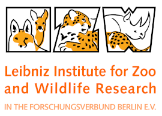
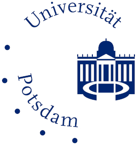
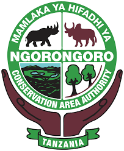
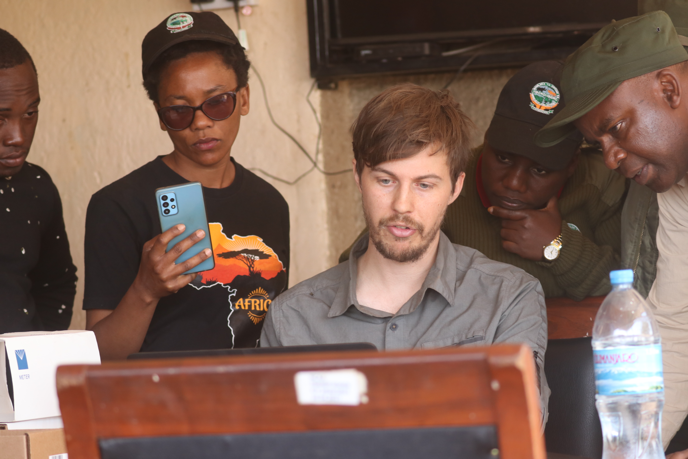

<script src="js/for_toc.js"></script>

This page describes the teaching we do within academia.
For teaching outside academia, please refer to our page on [consulting](consulting.html#external).
All courses are taught in English.


## Current teaching and workshops

:::float-right


### Data science for biologists: Generalized linear modelling with R

Alex teaches [this course](https://www.fu-berlin.de/vv/en/search?utf8=%E2%9C%93&query=courtiol&sm=682080) every even year at the Freie Universität in Berlin (FU for short).

It is designed for master's and PhD students from the [department of biology, chemistry and pharmacy at the FU](https://www.bcp.fu-berlin.de/en/index.html), but students from other universities can easily do the necessary paperwork to take part.

The course takes place during the summer semester and currently runs for 40 hours in class (2 full days a week, for 4 consecutive weeks).

The goal of this course is to teach students how to analyse most datasets on their own, and derive biological meaning from them.
The course specifically focuses on Generalised Linear Models (or GLMs for short) – a family of statistical models that aim to describe the effect of different variables on one outcome of interest.
The GLM is the most useful statistical tool for most natural scientists.
It is also the foundation of more complex methods, such as AI algorithms.
During this course students study GLMs in depth, favoring practical considerations over mathematics.
By the end of the course, they should be able to use a wide range of GLMs (i.e. LM, GLM, LMM, GLMM) and understand how to solve several common practical problems that show up when analysing real datasets.
They will also learn how to translate a concrete biological problem into a GLM.
All that is done with the open source software R, which is the most popular software for data science in the world.
:::

:::float-right


### Introductory course: Solving problems in biostatistical analysis and experimental design in the Life Sciences

Alex teaches this course at the Leibniz Institute for Zoo and Wildlife Research (or [IZW](https://www.izw-berlin.de/en/home.html)).

It is designed for PhD students from the IZW as well as those belonging to one of the following programs:

- the [Research Training Group 2046 *Parasite Infections: From Experimental Models to Natural Systems* ](https://www.vetmed.fu-berlin.de/en/einrichtungen/sonstige/grk2046/index.html) also known as GRK 2046 or Grako.
- the [International Max Planck Research School for Infectious Diseases and Immunology](https://www.mpiib-berlin.mpg.de/graduate_program/general_information) also known as IMPRS.
- the Graduate School of the [Interdisciplinary Center of Infection Biology and Immunity](https://www.zibi-berlin.de/training/zibi-graduate-school/index.html) also known as ZIBI.
- the [Dahlem Research School](https://www.drs.fu-berlin.de/) also known as DRS.

The course is a 5-day block course occurring twice every year: once in November or December and once in January or February (exact dates depend on the year).

This is an introductory course, so no preliminary knowledge in statistics or R is required.
It is however helpful if students have their research questions and experimental designs in mind.
On day 1, Alex reviews the basics of the statistical software and programming language called [R](https://www.r-project.org/).
On days 2-3, he teaches fundamental concepts in statistics such as: population, sample, distribution, null hypothesis, statistical significance, p-values, statistical power, multiple testing, replications...
On days 3-4, he introduces several useful non-parametric tests.
On days 4-5, he introduces linear models (LM, GLM) and a few other parametric tests that are good to know.
:::

:::float-right


### Conservation Genetics {#teaching_conservation_genetics}

Alex and Liam perform some of the teaching of a course on Conservation Genetics (Naturschutzgenetik) organised by [Jörns Fickel](gang.html#joerns_fickel) for the [University of Potsdam](https://www.uni-potsdam.de/en/university-of-potsdam?land=Irland).

Alex teaches a 1-day course on R for genetics and genomics with [Daniel Förster](https://www.izw-berlin.de/en/daniel-foerster-en.html).

Liam teaches an introduction to R.
:::

:::float-right


### International summer school on stable isotopes in Animal Ecology

Every other year, [Christian Voigt](https://www.izw-berlin.de/en/christian-voigt-en.html) organises a summer school aiming to give PhD students an overall introduction to the various uses of stable isotopes in the study of animal ecology.

In this context, Alex gives a 1-day course on how to use [IsoriX](packages.html#main_packages), an R package that can be used to infer the origin of migratory lifeforms based on their isotopic signatures.
:::

:::float-right


### Working with weather station data in Ngorongoro Crater

Liam teaches how to work with data from our network of weather stations in the Ngorongoro Conservation Area (see a report of our data [here](https://github.com/LiamDBailey/Ngorongoro_weather_report/blob/5f579ec9aeb30d258bb32b2ef911d2fe8486c6e2/reports/NCAA_weather_report.pdf)). We include both introductory techniques using Microsoft Excel and more advanced techniques in R. This workshop is run for the Ngorongoro Conservation Area Authority, which allows local conservation managers to use weather data for their conservation goals. 

:::


## Former teaching

:::float-right


### Advanced course: Solving problems in biostatistical analysis and experimental design in the Life Sciences

Alex taught this course, for several years, at the Leibniz Institute for Zoo and Wildlife Research (or [IZW](https://www.izw-berlin.de/en/home.html)).

The point of this course was primarily to discuss and resolve every participant's (statistical) problem.

The course is no longer running since it became redundant with the fortnightly statistical seminars at the IZW, which we co-organise with [Emanuel Heitlinger](https://scholar.google.com/citations?user=ZgBJ3aAAAAAJ).
:::

### Other former courses

:::float-right

- In Berlin (Germany), Alex has taught the course **Current and classic topics in Evolution and Ecology** at the Freie Universität, to replace [Jens Rolff](https://www.bcp.fu-berlin.de/en/biologie/arbeitsgruppen/zoologie/ag_rolff/index.html) who was on sabbatical.
:::
:::float-right

- In Sheffield (UK), during his postdoc, Alex taught an introduction to R with [Andrew Beckerman](https://andbeck.github.io/beckslab/).
:::
:::float-right

- In Montpellier (France), during his PhD, Alex taught population genetics and various practicals in ecology.
:::

```{r, fig.align='center', out.width=200, echo=FALSE}
knitr::include_graphics(path = "images/african_elephant.jpg")
```

